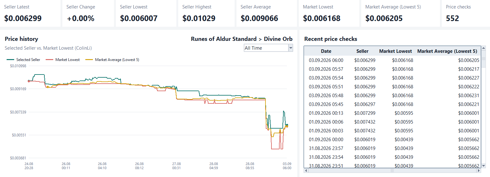

<p align="center">
  
</p>

# G2G Price Tracker

A tool for tracking a seller's price on supported G2G category pages. It keeps
a local price history, compares the selected seller with the market, and can alert
you when the seller price drops below a desired threshold.

I started this project because checking the same listing by hand every time was
slow and made it difficult to see how prices changed over time, even when I'm sleeping.
The goal was a tool that could collect the numbers to catch the trend without running
a browser in the background.

> This is an independent project and is not affiliated with G2G. It does not try
> to bypass access controls. Please use reasonable tracking intervals and follow
> the source site's terms and policies.

## Preview



## What it does

- Tracks an exact seller on a supported G2G category URL.
- Records the seller price, market's lowest price, and average of the five lowest
  market offers.
- Stores each seller and source URL as a separate history in SQLite.
- Shows summary metrics, a time-filtered chart, and a recent-checks table.
- Exports the current view as PNG and the complete selected history as Excel.
- Supports optional sound and Telegram alerts below a desired threshold.
- Includes light and dark themes, system-tray support, and an optional Windows
  startup setting.
- Keeps application data on the local computer.

## Setup

Requirements:

- Windows 11
- Python 3.11 or 3.12
- An internet connection

Clone or download the repo, then run:

```powershell
.\setup.cmd
```

The `setup.cmd` creates a virtual environment, installs the dependencies, builds
`G2GPriceTracker.exe` in the project folder, creates a desktop shortcut, and opens
the application. Note that the EXE is generated locally and is not committed to the
repository.

Run `setup.cmd` again after pulling a new version or changing the source code.

## Usage

1. Enter the seller name on G2G.
2. Open the category and filters you want to track.
3. Set 'Sort by' to `Lowest`.
4. Copy that page URL into `G2G source URL`.
5. Choose a tracking interval.
6. Select `Check now` for one request or `Start tracking` for repeated checks.

`Export data` will export a timestamped PNG and XLSX file in the folder you choose.
You can configure alerts and appearance in the Settings tab.

## How it works

The application converts the selected category URL into parameters for the public
JSON endpoint used by the G2G frontend. Each check requests the selected seller and
the five lowest market offers, validates the response, and stores a normalized
observation in SQLite.

The actual network requests are handled outside of Tkinter's main thread to avoid
freezing the UI; the results are then pushed to a queue from which the views read
updates. Similarly, the long tail of the price observation history is truncated for
display purposes; the actual database records are not deleted.

The main modules are:

```text
src/g2g_price_tracker/
├── desktop.py       Desktop UI and tracking scheduler.
├── scraper.py       URL parsing, requests, and response validation.
├── database.py      SQLite schema and queries.
├── models.py        Domain objects and target identity.
├── exporting.py     Excel export generation.
├── alerts.py        Price-alert decisions, sound, and Telegram.
├── settings.py      Persisted application preferences.
├── secret_store.py  Windows DPAPI storage for the Telegram token.
├── tray.py          System-tray integration.
└── startup.py       Windows startup registration.
```

## Local data and privacy

Runtime files are stored under:

```text
%LOCALAPPDATA%\kuti-code\G2GPriceTracker\
```

This includes the SQLite database, settings, rotating logs, and the optional
Telegram token. The token is encrypted with Windows DPAPI and is not written to
`settings.json` as plain text.

The application connects to G2G for price data and to Telegram only when Telegram
notifications or the connection test are enabled. No database, settings file,
virtual environment, or generated executable is included in the source archive.

## Development

After initial setup, you can launch the current source version without rebuilding
the EXE by running the following command:

```powershell
.\.venv\Scripts\python.exe launcher.py
```

Run the test suite and code checks with:

```powershell
.\.venv\Scripts\python.exe -m unittest discover -s tests
.\.venv\Scripts\python.exe -m ruff check .
.\.venv\Scripts\python.exe -m ruff format --check .
```

Tests use mocked responses and local fixtures; the automated suite does not send
requests to G2G. Some Tkinter tests require a desktop session and are skipped in a
headless environment.

## Known limitations

- The data source is an endpoint used by the G2G web frontend, not a documented
  public developer API. A response-format change may require an update to
  `scraper.py`.
- HTTP 403 and 429 responses are reported rather than bypassed.
- The desktop application and build script currently target Windows.
- A generated EXE may trigger a Windows reputation warning because it is not code
  signed. Building it locally avoids downloading an unknown third-party binary but
  does not add a publisher signature.

## License

Copyright (c) 2026 kuti-code.

Licensed under the [MIT License](LICENSE).
